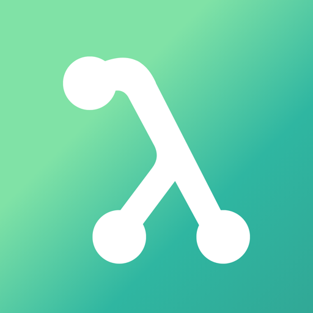

<p align="center">
  
</p>

<h1 align="center">EigenForm</h1>

Real-time, on-device gym form tracking for iOS. The coaching pipeline is native
stack only — SwiftUI, AVFoundation, Vision (`VNDetectHumanBodyPoseRequest`),
`AVSpeechSynthesizer` — and no video ever leaves the device. The one third-party
dependency is [supabase-swift](https://github.com/supabase/supabase-swift), used
for accounts and workout-history sync (only finished-set summaries are uploaded,
never video or pose data).

Watches you through the camera, draws a live skeleton overlay (with an optional
joint-angle readout), counts reps, and coaches your form with spoken cues plus a
scrolling on-screen transcript. Finished sets are saved to your workout history.

**Exercises:** Bicep curl (desk-testable sandbox) · Squat · Pushup · Pullup

## Running it

Requires Xcode 16+ and an iOS 17+ **physical device** (the simulator has no camera).

```bash
open Eigenform.xcodeproj
```

Select your device, set your development team under Signing & Capabilities, and run.
The project uses filesystem-synchronized groups, so files added under `Eigenform/`
appear in Xcode automatically.

> **Tip:** if `xcodebuild` ever fails to load `IDESimulatorFoundation` after an
> Xcode update (stale system content), run `sudo xcodebuild -runFirstLaunch` once.

### Quick start in the gym

- **Curl:** face the camera, whole arm in frame.
- **Squat / Pushup:** stand **side-on**; the app tells you if you're facing the
  wrong way.
- **Pullup:** face the camera, head and both hands visible.

Reps are announced by count; form faults ("Keep your heels down", "Lift your hips")
are spoken at most once per 3 s per fault type, ducking your music instead of
pausing it.

## Testing the logic without a phone

The biomechanics math and all four exercise state machines are pure Swift and run
natively on macOS:

```bash
Tests/run_tests.sh
```

Drives each analyzer with synthetic pose sequences: rep counting, hysteresis,
double-count prevention, debounce of jitter blips, depth/heel/sag/pike fault cues,
confidence filtering, and reset behavior — plus the workout-history record model
(day grouping and wire format). 89 assertions.

## Architecture

One-way pipeline; each stage owns one job:

```
CameraManager            AVCaptureSession on a background queue; buffers pre-rotated
      │                  to upright portrait (720×1280 BGRA, late frames dropped)
      ▼
PoseEstimator            VNDetectHumanBodyPoseRequest per frame → BodyPose
      │                  (camera output queue — the expensive stage)
      ▼
BodyPose                 Joints in Vision space (bottom-left origin), confidence-
      │                  filtered at 0.3; metricPoint() = aspect-corrected space
      ▼
ExerciseAnalyzer         One state machine per exercise (main actor). Emits
      │                  FormEvents: repCompleted / fault / phaseChanged / guidance
      ▼
FeedbackEngine           AVSpeechSynthesizer + transcript log. Per-category 3 s
      │                  throttle; audio ducks other playback
      ▼
SwiftUI                  Camera preview + skeleton overlay + HUD + transcript
```

Key files:

| Path | Role |
|---|---|
| `Eigenform/Camera/CameraManager.swift` | Capture session, permissions, rotation, camera flip |
| `Eigenform/PoseEstimation/BodyPose.swift` | Coordinate spaces + confidence filtering (read this first) |
| `Eigenform/Biomechanics/BiomechanicsCalculator.swift` | Angle / perpendicular-distance / signed-offset math |
| `Eigenform/Biomechanics/ConsecutiveFrameGate.swift` | 3-frame anti-jitter debouncer |
| `Eigenform/Exercises/*Analyzer.swift` | Per-exercise state machines, thresholds as named constants |
| `Eigenform/Feedback/FeedbackEngine.swift` | Speech, throttling, transcript |
| `Eigenform/Session/WorkoutSessionViewModel.swift` | Pipeline glue + threading model |

## Known limitations (MVP)

- 2D pose only: angle accuracy degrades when the movement plane isn't perpendicular
  to the camera axis. Setup-guidance cues mitigate; `VNDetectHumanBodyPose3DRequest`
  (iOS 17+) is the upgrade path.
- The joint-angle readout is view-aware (frontal vs sagittal classification plus
  a foreshortening backstop) but still 2D-limited: oblique camera angles and
  unusual limb poses can briefly hide or show a joint at the hysteresis edges.
- Thresholds are sensible defaults, not per-user calibrated. Each is a named
  constant on its analyzer, ready to be made configurable.
- Ankle-baseline heel-lift detection is approximate (see ADR-002 §1).
- Single person in frame assumed (first observation wins).
- Portrait orientation only.
